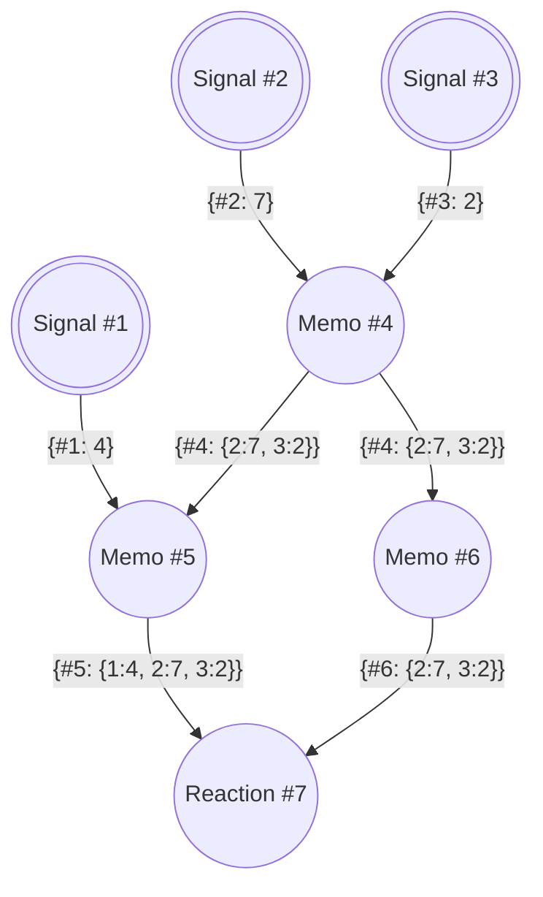

# Causality Trigger Clock (CTC) — Phase 1

Implementation notes for [issue #39](https://github.com/timonkrebs/MemoizR/issues/39): a
space-efficient causality mechanism, inspired by
[Interval Tree Clocks](https://gsd.di.uminho.pt/members/cbm/ps/itc2008.pdf), that prepares
MemoizR for glitch-free synchronization of **distributed** graphs. Within one process the
locking layers already guarantee glitch-freedom (see
[concurrency.md](concurrency.md)); stamps make that property *checkable* where locks cannot
reach — across process boundaries, in dynamically changing graphs.

Phase 1 delivers the semantics: node identity, per-signal trigger counters, per-node stamps
captured at source-read time, and the untorn `(value, stamp)` publication. Phase 2 (§6)
replaces the naive dictionary inside `CausalityStamp` with the ITC-inspired canonical event
tree and adds the compact wire format — same API, byte-deterministic serialization. Phase 3
adds reset resilience and the public API for a distributed sync layer.

---

## 1. The model

- Every node gets a stable, per-`Context` **id** (`SignalHandlR.Id`, a monotonic counter).
- Every signal carries a **trigger** — a version counter for *value changes*:
  - `Signal.Set` bumps it **only when the value actually changes** (the value-unchanged
    short-cut propagates `CacheCheck` and leaves the trigger alone — the trigger mirrors
    exactly what observers are told);
  - `EagerRelativeSignal.Set` bumps on **every** Set (it has no equality short-cut and always
    propagates `CacheDirty`).
- Every node publishes a **stamp** (`CausalityStamp`): a map *signal id → trigger* describing
  exactly which signal versions its current state reflects.
  - A signal's stamp is the single entry `{ #id: trigger }`.
  - A derived node's stamp is the **join** (pointwise max) of the stamps it observed on its
    tracked source reads during its last completed evaluation: `{ #6: { 2:7, 3:2 } }` in the
    issue's notation.
- Every derived node additionally keeps **a stamp per source** (`SignalHandlR.SourceStamps`,
  keyed by source id) — "every Node keeps a Stamp for each of its Sources" — the data a future
  distributed sync protocol exchanges.

Two stamps are **consistent** (`IsConsistentWith`) when they agree on every signal both track;
disjoint stamps are trivially consistent. That predicate is the glitch detector: a node whose
inputs carry stamps that disagree on a shared signal would combine values from different
versions of the same write history.

The issue's example, as reproduced by `Issue39_DiamondExample_ReproducesIssueStamps`:



`Memo #5` and `Memo #6` agree on signals 2 and 3 → `Reaction #7` runs on a glitch-free
snapshot.

## 2. The one invariant that matters: never over-claim

A published stamp must record **exactly** the triggers of the source publications the value was
computed from — never newer ones. An over-claiming stamp could make a distributed consistency
check pass against a write the value does not actually reflect (a missed glitch). An
under-claiming stamp merely fails conservatively (a spurious recheck). Every design decision
below follows from choosing the safe direction:

1. **Stamps are captured at read time, not at publish time.** Walking `Sources` when the
   evaluation finishes would read stamps that may have advanced past the values actually used.
   Instead, every tracked `Get` reads its node's `(value, stamp)` box **once** and reports that
   stamp — the pair can never be split.
2. **The known under-claim.** A node in its `CacheCheck` parent scan whose parent recomputed to
   an *unchanged* value does not recompute — and therefore keeps its older stamp, even though
   the parent's stamp advanced. Refreshing from the parents at commit time would be unsound
   under a racing `Set` (the refreshed stamp could absorb a write whose recompute outcome was
   never verified), so the stamp stays old. Documented by
   `Memo_SkippedRecompute_KeepsOlderStamp_NeverOverclaims`.
3. **Untracked reads (`Untrack`) are not stamped** — the stamp mirrors the dependency graph,
   which deliberately does not see them.

## 3. How capture works

A node's evaluation opens a **capture bucket** in the `Context`
(`BeginStampCapture` / `RecordSourceStamp` / `TakeStampCapture` / `DiscardStampCapture`, all
under `Context.Lock` — a leaf monitor, per the lock-order rules in concurrency.md §9).

The registry is keyed by the **evaluating node**, not by flow or scope, because:

- structured-concurrency children read on their own flows/scopes (`ConcurrentMap` even forces
  fresh scopes per child) but evaluate *on behalf of* the owning node — their
  `CurrentReaction`. Keying by node collects one evaluation's reads into one bucket without
  touching the job machinery;
- nested evaluations are naturally disjoint — while an inner memo recomputes, its own
  `CurrentReaction` is installed, so its reads land in *its* bucket; the parent records the
  inner memo's resulting stamp when the parent's read of it returns — no push/pop needed;
- the per-node mutex (invariant I1) guarantees at most one open capture per node.

A record against a node with no open bucket is **dropped**: that is the correct fate of a
superseded `ConcurrentRace` loser that reads a source after the winner already published and
closed the bucket — its read did not feed the published value.

Re-reads of the same source within one evaluation join into one entry (the join is the monotone
upper bound of the publications the value may have consumed).

On success the evaluation **takes** the bucket and publishes: own stamp = join of the captured
stamps, `SourceStamps` = the bucket (swap-published, never mutated afterwards). On the failure
paths (exception, cancellation, paused reaction) the bucket is discarded and the node keeps its
previous stamp — matching the value, which also stays.

## 4. Publication and the memory model

The stamp rides **inside the existing `ValueBox`** (`MemoHandlR<T>`): one volatile reference
swap publishes `(value, stamp)` together, so the release/acquire argument of concurrency.md §7
covers the pair unchanged, and no reader can ever pair a new value with an old stamp
(`Signal_ValueAndStampPair_IsNeverTorn` stresses this).

Signal trigger bumps are a read-modify-write of that box under the signal's own `Lock` — the
same monitor that already serialized value writes across concurrent `Set` flows
(`Signal_ConcurrentDistinctSets_CountEveryChange` pins the exactly-once bump).

Reactions have no value box; their joined stamp lives in a volatile field on `SignalHandlR`
(`ownStamp`), written only inside their serialized update path.

The interplay with the cache-state protocol is deliberately one-way: stamps piggyback on the
existing evaluation windows and commit points and add **no** new states, generations, or
ordering requirements. A recompute whose Clean commit is refused by the generation guard has
already published an honest `(value, stamp)` pair — both describe the same (now superseded)
reads — and the node stays dirty, so the next `Get` replaces both.

## 5. What is deliberately left out (phase 3)

- **Reset resilience**: plain counters are not reset-safe — a restarted signal would
  reissue lower triggers. This needs epochs/incarnations or ITC-style id forking, plus the
  public API (`GetWithStamp()`-shaped) for the sync layer. Everything is `internal` until then,
  and the wire format below may still be revved (with a version bump) until phase 3 freezes it.
- **Enforcement**: no local code path *acts* on an inconsistency — locally, the locks already
  prevent glitches; the stamps maintain and expose the evidence.

## 6. The encoding (phase 2): a canonical event tree

`CausalityStamp` stores the id→trigger map as an ITC-style **event tree** over the id space
`[0, 2^spanBits)`. The value of an id is the **sum of the `N` fields along its path**; a leaf
is uniform over its whole span. "Untracked" is encoded as value `0` and "tracked at trigger t"
as `t + 1`, which turns the finitely-supported map into a total function with default 0 —
exactly the shape ITC event trees compress:

- **untracked gaps** and **batches of fresh signals** (created together → contiguous ids, all
  at trigger 0 → uniform value 1) collapse into single leaves — 64 contiguous fresh signals
  serialize to a handful of bytes (`ContiguousFreshSignals_CollapseToAHandfulOfBytes`);
- a region whose triggers all advanced shares the common minimum in its parent (`min`-lifting),
  compressing even when the exact values differ;
- trees are **persistent**: `Join` reuses whole subtrees of its operands, so a memo's stamp
  shares structure with its sources' stamps, and reference-equal subtrees short-circuit joins
  and consistency walks.

**Normal form** (every tree is built through the normalizing constructor): an internal node's
children carry `min(left.N, right.N) == 0` — so a subtree's minimum value *is* its root `N`,
which is what makes `min`-lifting O(1) — and two equal leaf children collapse into their
parent. The stamp additionally **trims** the root: an all-zero upper half is dropped, giving
equal logical maps identical `(tree, spanBits)` pairs regardless of construction order.
Structural equality is therefore semantic equality, and serialization is **deterministic**
(`CanonicalForm_MakesSerializationJoinOrderIndependent` pins this byte-for-byte). The
randomized model test (`RandomizedJoins_MatchTheDictionaryModel`) checks every operation
against the naive dictionary semantics phase 1 shipped with.

**Wire format** (`Serialize`/`Deserialize`):

```
stamp  := version:byte spanBits:byte node
node   := varint(N << 1 | isLeaf) [node node]   -- children present iff the isLeaf bit is 0
varint := little-endian base-128, high bit = continuation
```

A preorder walk with varint-coded headers: the common leaf costs one byte. `Deserialize`
validates structurally — version, `spanBits ≤ 31`, a node spanning a single id must be a leaf
(which also bounds the recursion), no truncation, no trailing bytes — and **re-canonicalizes**
defensively, so the equality and determinism guarantees hold for any parseable input, not just
payloads we produced (`Deserialize_CanonicalizesForeignInput`).
