# MemoizR Concurrency Architecture

This document is the deep dive into how MemoizR stays correct under concurrency: the
synchronization layers, the cache-state protocol, the lock-free read path, the cross-flow
lost-update guard, and the structured-concurrency fork/join model. It complements the two ADRs,
which record the *decisions*; this document explains the *mechanisms* and proves out the tricky
interleavings with diagrams.

- [ADR 0001 — Use of `volatile` fields](../adr/0001-volatile-field-usage.md)
- [ADR 0002 — Choosing a lock](../adr/0002-choosing-a-lock.md)

All diagrams are [Mermaid](https://mermaid.js.org/) and render on GitHub.

---

## 1. The shape of the system

MemoizR is a concurrent reactive graph with **push-pull** semantics: writes (`Set`) *push*
invalidation down the graph, reads (`Get`) *pull* recomputation up the graph lazily, and
reactions are *pushed* via debounced background updates.

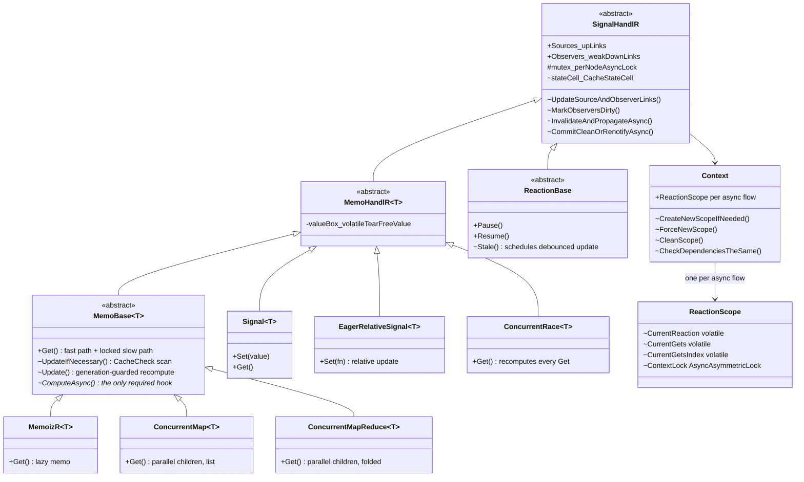

Graph edges are doubly linked: a node's `Sources` point up at what it reads, and each source's
`Observers` point down (as **weak** references, so dropped nodes are collected and pruned
lazily). Both arrays are only ever **swapped wholesale** — never mutated in place — which is what
makes their lock-free reads safe (§4, discipline 3).

A `MemoFactory` owns one `Context`; factories constructed with the same context key share a
`Context` through a static weak map, so independent factories are fully isolated by default.

---

## 2. Execution model: async flows and scopes

Concurrency in MemoizR is organized around **async flows**, not threads. A flow is the chain of
continuations descending from one logical operation; work hops threads freely across `await`.
Flow identity is carried by `AsyncLocal<double>` keys:

- `Context.CreateNewScopeIfNeeded()` pins a scope to the current flow if it has none and reports
  whether it created one — **only the creator cleans up** (`CleanScope`), because a flow can be
  shared by an enclosing evaluation whose scope must survive nested calls (e.g. `Resume()` inside
  a memo's fn).
- `Context.ForceNewScope()` unconditionally mints a fresh scope — used by structured-concurrency
  children that must *not* share their parent's dependency capture (§8).
- The `Context.ReactionScope` getter resolves the current flow's scope from a dictionary of weak
  references (under `Context.Lock`); a flow with no pinned key gets a throwaway scope per access.

Each `ReactionScope` carries the flow's **dependency-capture state** (`CurrentReaction`,
`CurrentGets`, `CurrentGetsIndex`) and the flow's **`ContextLock`**. The lock being *per-flow* is
the single most consequential design decision in the codebase (§5, §6):

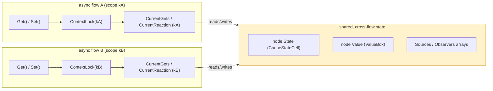

**Why per-flow, not one big lock?** Structured-concurrency children (`ConcurrentMap*`) fork onto
their own scopes and are awaited by the parent. With a single shared graph lock, the parent would
hold the lock across `await Task.WhenAll(children)` while every child blocks trying to acquire
it — a guaranteed deadlock. The per-flow lock dissolves that cycle, but it deliberately leaves the
highlighted *shared* state unserialized across flows. Everything in §4–§6 exists to make that
shared state correct anyway.

---

## 3. The five synchronization layers

| # | Mechanism | Protects | Held across `await`? | Where |
|---|-----------|----------|----------------------|-------|
| 1 | `System.Threading.Lock` monitors | short synchronous critical sections | no (compiler-enforced) | `Context.Lock`, `SignalHandlR.Lock` (interface array setters), `CacheStateCell.gate`, `StructuredJobBase.Lock`, `Signal.Lock`, `lock(this)` in `ReactionBase.Stale` |
| 2 | Nito `AsyncLock` (`mutex`, one per node) | "at most one evaluation of *this node* at a time" | yes | every node's `Get`/`IMemoizR.UpdateIfNecessary`; reactions' debounced update and `Resume` |
| 3 | `AsyncAsymmetricLock` (`ContextLock`, one per flow) | graph evaluation *within* a flow; write/read asymmetry | yes | `Set` (exclusive), `Get`/recompute (upgradeable) |
| 4 | `volatile` + immutable `ValueBox` | the lock-free `Get` fast path | n/a (lock-free) | `CacheStateCell.state`, `ReactionScope.CurrentReaction/CurrentGets/CurrentGetsIndex`, `MemoHandlR<T>.valueBox` |
| 5 | **Generation guard** (`CacheStateCell`) + renotify | cross-flow `State` transitions (optimistic concurrency) | n/a (monitor inside) | every cached node: `MemoizR`, `ConcurrentMap`, `ConcurrentMapReduce`, `ReactionBase` |

Layers 1–3 are pessimistic (mutual exclusion); layers 4–5 are the deliberate exceptions: a
lock-free read path (4) and an optimistic commit protocol (5) for the state no single lock covers.

Every shared field must be safe under exactly **one** publication discipline (ADR 0002):

1. **One consistent monitor** — all reads and writes under the same lock (`locksHeld`,
   `Context`'s scope dictionary, `CacheStateCell` transitions under `gate`).
2. **`volatile`** — for fields read on paths no single monitor covers (the fast path, and
   `CurrentGets`/`CurrentGetsIndex`, which are written under `Context.Lock` but read under the
   job `Lock` by `StructuredReduceJob`'s parallel children — two different monitors, no
   happens-before edge without `volatile`).
3. **A coarser happens-before barrier** — the fork/join (`await Task.WhenAll`) for job results;
   whole-array swaps + per-flow serialization for `Sources`/`Observers`.

---

## 4. The cache state machine

```csharp
internal enum CacheState
{
    Evaluating = -1,   // lowest: any invalidation escalates over it
    CacheClean = 0,
    CacheCheck = 1,    // "a parent may have changed; verify before trusting"
    CacheDirty = 2,    // "a parent definitely changed; recompute"
}
```

The numeric ordering is load-bearing: invalidation only ever **escalates** (`newState > state`),
and `Evaluating` being the *minimum* means a `Stale` that lands during a recompute always
escalates past it (and therefore always bumps the generation — §6).

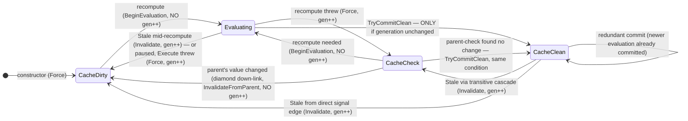

Who writes the state, and under what:

| Transition | API | Generation | Caller / lock context |
|---|---|---|---|
| escalate (Stale) | `Invalidate(s)` | **always `gen++`**, even when suppressed | `Set` cascade, renotify; inside `gate` (and `lock(this)` for reactions) |
| diamond down-link | `InvalidateFromParent(s)` | **no bump** | a parent's `MarkObserversDirty` after recomputing to a changed value |
| begin recompute | `BeginEvaluation()` | snapshot returned, no bump | node's own `Update`, under mutex + ContextLock |
| unconditional set | `Force(s)` | `gen++` | constructor, pause path, catch paths |
| commit | `TryCommitClean(token)` | commits iff `gen == token` | end of `Update` / `UpdateIfNecessary` |
| commit + recover | `CommitCleanOrRenotifyAsync(token)` | on refusal, re-propagates `Stale(CacheCheck)` to observers | final commits of cached nodes |

The current state is exposed through a single `volatile` read so the fast path never takes the
gate; only writers do.

---

## 5. The write path: `Set` and the invalidation cascade

`Signal.Set` takes its flow's `ContextLock` **exclusively**, swaps the value (one `ValueBox`
allocation — an atomic, tear-free publish), and pushes a `Stale` cascade through the observer
down-links: `CacheDirty` to direct observers, decaying to `CacheCheck` for everything deeper
(deeper nodes only know a parent *might* have changed).

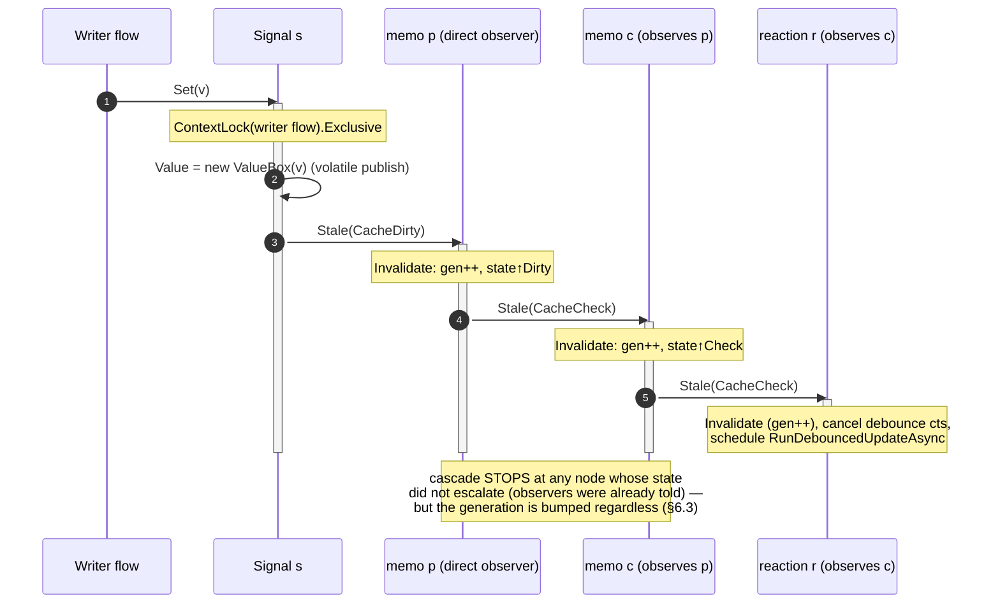

Two cascade properties matter later:

- **Early termination**: if a node was already at least as dirty, its observers were notified
  when it *first* reached that state, so propagation stops there. This is the termination
  guarantee (no exponential re-walks of diamond-heavy DAGs) — and it is exactly what creates the
  suppressed-notification window that §6.3 closes.
- **Reactions are push targets**: their `Stale` always (re)schedules the debounced update; the
  state cell decides later whether the update actually needs to execute.

---

## 6. The heart: cross-flow correctness of `State`

### 6.1 Why a lock can't do it

A node's `State` is written by `Set` cascades on writer flows and by recomputes on reader flows.
The `ContextLock` is per-flow (§2), so **no lock orders these writers**. The naive protocol loses
updates:

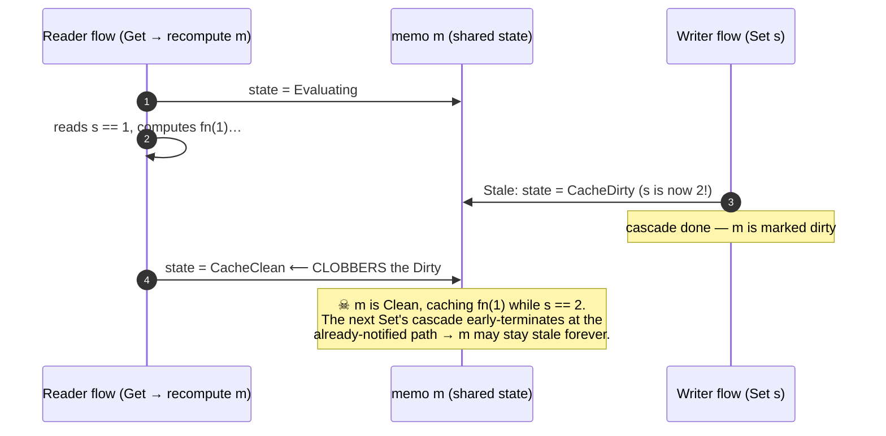

This is a textbook lost update. It was reproduced deterministically
(`Memo_StaleDuringRecompute_IsNotClobbered`) and on ARM CI before the guard existed.

### 6.2 The generation guard (optimistic concurrency)

`CacheStateCell` resolves it with a monotonic **generation** — optimistic concurrency control on
the state transition, all under a tiny monitor (`gate`) that is never held across `await`:

- every **invalidation** bumps the generation;
- every **evaluation** snapshots the generation when it starts (`Generation` for the
  parent-check phase, `BeginEvaluation` for the recompute itself);
- the final **commit** succeeds only if the generation is untouched (`TryCommitClean(token)`).

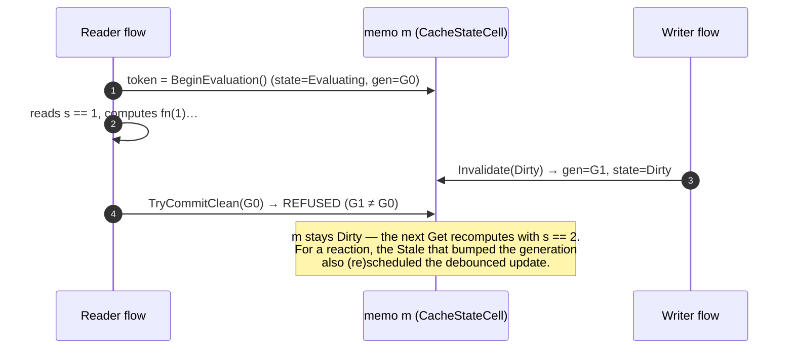

The fast path never takes the gate — it reads the `volatile` state — so reads stay lock-free;
only transitions pay the (uncontended, non-awaiting) monitor.

### 6.3 The suppressed-Stale hole and the two-part fix

The subtle failure mode: the cascade's early termination (§5) means a `Stale` that does **not**
escalate a node's state also used to leave **no generation trace**. A node parked in its
`CacheCheck` parent-scan could then commit Clean over a pending dirty parent — and because later
cascades *also* terminate at the already-dirty parent, **nothing would ever re-dirty it**:

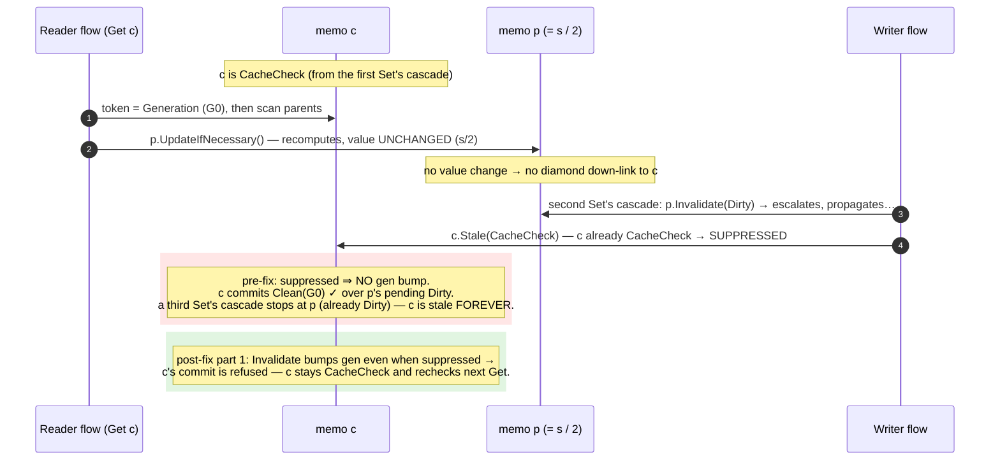

Regression test: `Memo_SuppressedStaleDuringParentCheck_IsNotClobbered` (uses `p = s/2` so
adjacent writes keep `p`'s value identical — the diamond down-link cannot mask the miss).

**Part 2 — renotify on refused commit.** Bumping the suppressed node protects *that node*, but
its **observers** may have committed Clean against its pre-invalidation value inside the same
window (their own cascade notification was suppressed one level up). So when a *final* commit is
refused, `CommitCleanOrRenotifyAsync` re-propagates `Stale(CacheCheck)` to observers — which for
a reaction also reschedules its debounce:

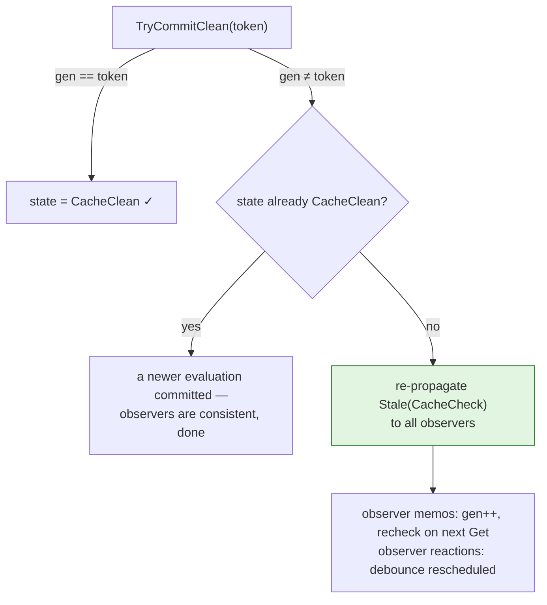

This only runs on actual commit failures (a race already happened), so it adds nothing to the
uncontended path, and it terminates: re-propagation recurses only through *escalations*, which
are monotone on a finite DAG.

### 6.4 The diamond rule: absorption without a bump

One invalidation source deliberately does **not** bump the generation: the **diamond down-link**.
When a parent recomputes to a changed value, it marks its observers `CacheDirty` through the
`IMemoizR.State` setter → `InvalidateFromParent`:

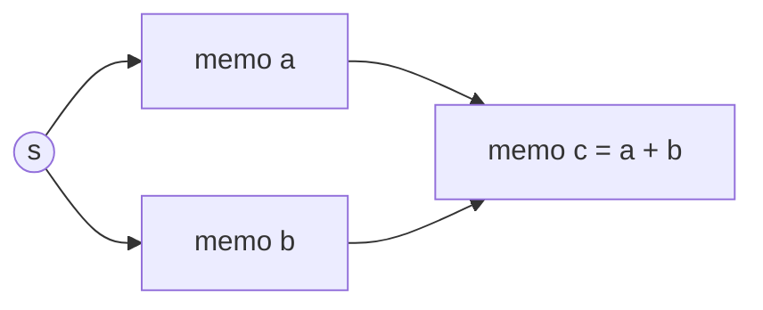

During `c`'s *own* evaluation, `c` reads `a`; if that read recomputes `a` (same flow!) and `a`'s
value changed, `a` marks `c` dirty mid-evaluation. That mark is **not** a concurrent
invalidation — `c` is literally consuming the new value right now. Bumping would force a
pointless second recompute of `c` on every diamond. So `InvalidateFromParent` escalates the state
but leaves the generation alone, and `c`'s commit (which transitions the absorbed `Dirty` back to
`Clean`) succeeds.

Why this is safe cross-flow: a parent's value can only change because some `Set` ran, and that
`Set`'s cascade independently bumped every transitive observer (suppressed or not — §6.3). Any
evaluation of `c` whose snapshot predates that cascade is already doomed to a refused commit;
any evaluation that started after it reads the fresh values.

---

## 7. The read path: lock-free fast path and its memory model

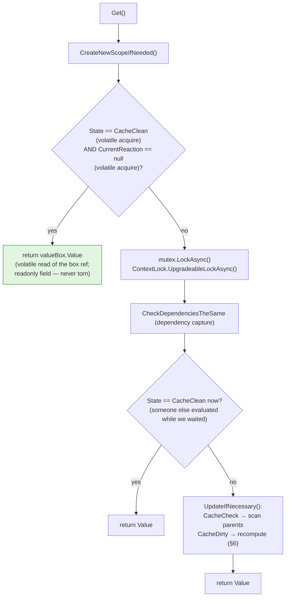

The fast path reads three things with **no lock held** while writers run under locks elsewhere.
Its correctness is a release/acquire argument plus safe publication:

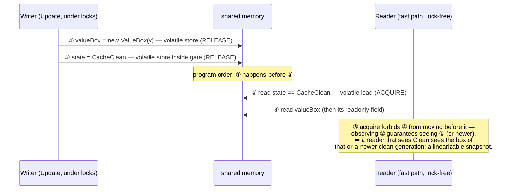

- **No tearing for any `T`:** a generic `T` can be neither `volatile` nor `Volatile.Read` (the
  generic overload is class-constrained), and a wide struct could be read half-written. The
  `ValueBox` is an immutable single-`readonly`-field class behind a `volatile` reference: writers
  swap fully-constructed boxes; readers dereference once. (Regression:
  `Memo_ConcurrentFastPathReads_NeverTearWideStruct`, a 16-byte struct whose halves must match.)
- **Point-in-time, not stale:** a writer may dirty the memo immediately *after* the read — that
  read simply linearizes before the write, which is correct. A caller that needs its own prior
  `Set` observed already has a program-order/`await` edge to it, which makes the dirty state
  visible and routes the read onto the locked path.
- The cost is one small allocation per `Value` **write** (including `Signal.Set` — an accepted
  trade-off recorded in ADR 0001), and zero allocation on reads.

---

## 8. `AsyncAsymmetricLock`: the per-flow graph lock

The `ContextLock` is a custom async lock with two modes and *flow-scoped reentrancy*. Scope
identity is an `AsyncLocal<double>` key minted on first acquisition, so reentrancy follows the
async flow — not the thread (work hops threads across `await`).

| held \ requested | exclusive, same scope | exclusive, other scope | upgradeable, same scope | upgradeable, other scope |
|---|---|---|---|---|
| **nothing** | grant | grant | grant | grant |
| **exclusive** | ❌ throw ("recursive exclusive") | queue | ✅ grant (nested) | queue |
| **upgradeable** | ❌ throw ("exclusive in the scope of an upgradeable") | queue | ✅ grant (recursive) | queue |

The two ❌ cells are deliberate **deadlock-to-exception conversions**: an exclusive acquire that
would wait for a lock its own flow already holds can never be granted, so it throws immediately
instead of hanging. (This is why a reaction body must not call `Signal.Set` on its own flow.)

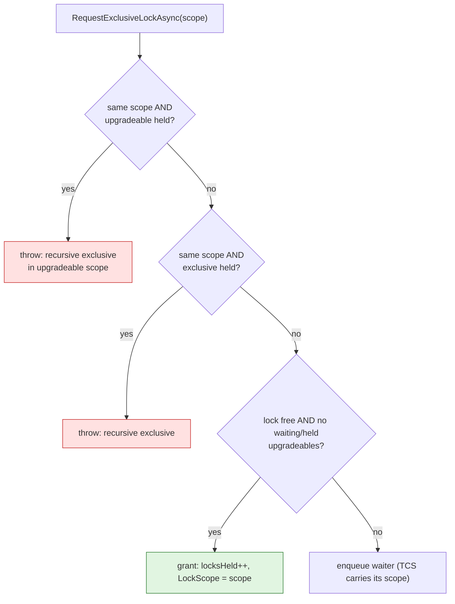

Internals worth knowing:

- All bookkeeping (`locksHeld`, `upgradedLocksHeld`, `lockScope`, both waiter queues) is guarded
  by one monitor (`lock (Lock)`); the *waiting* happens on dequeued `TaskCompletionSource`s
  **after** the monitor is released — the lock never blocks a thread.
- `locksHeld` counts exclusive holds only; upgradeable holds live in `upgradedLocksHeld` (the
  counter never goes negative).
- **Handoff** (`ReleaseWaiters`): when the lock fully drains, the next waiter is granted —
  upgradeable waiters preferred — by completing its TCS and stamping `LockScope` with *the
  waiter's own scope*. Critically, the releaser must **not** touch the `AsyncLocal` (it runs on
  the releasing flow; `AsyncLocal` mutations never reach the suspended waiter), or it would
  corrupt its own flow's scope — a real historical bug, pinned by
  `ReleasingFlow_DoesNotCorruptScope_WhenHandingOffToWaiter`.

Note what this lock does **not** do: two operations on *different* flows lock *different*
scopes' locks and are not ordered by it at all. Cross-flow correctness is layers 4–5 (§6, §7) —
the ContextLock's job is intra-flow serialization plus the write/read asymmetry within a flow.

---

## 9. Lock ordering and deadlock freedom

Every path acquires locks in the same global order, and the acquisition graph is acyclic:

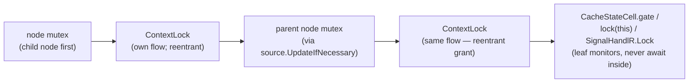

- **Mutex order is child → parent**, following `Sources` up-links. The graph of up-links is a
  DAG (a cycle in it would already be a logical cycle in the user's graph), and *nothing*
  acquires a mutex while propagating *down*: `Stale` cascades and `MarkObserversDirty` touch
  only leaf monitors. So no mutex cycle exists.
- **ContextLock acquisitions within one flow are reentrant** and therefore never self-block;
  cross-flow acquisitions target different lock instances entirely.
- **Leaf monitors never wrap an `await`** (the compiler rejects `await` under `lock`), so they
  cannot participate in any cross-task cycle.
- The reaction mutex (§11) is acquired *before* the ContextLock, the same order as `Get`.

---

## 10. Structured concurrency: fork/join jobs

`ConcurrentMap` / `ConcurrentMapReduce` evaluate N child functions in parallel under a
**fork/join** discipline with resource scoping and cancel-on-failure:

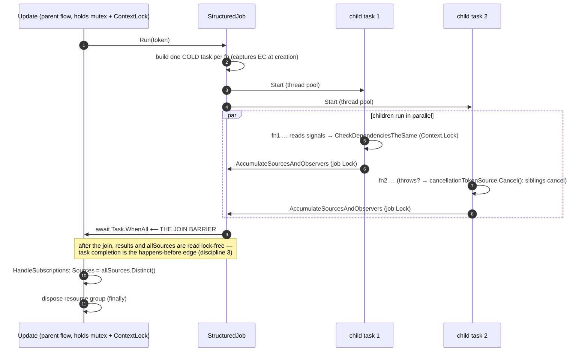

The two jobs differ in one crucial way:

| | `StructuredResultsJob` (ConcurrentMap) | `StructuredReduceJob` (ConcurrentMapReduce) |
|---|---|---|
| child scope | `ForceNewScope()` per child — isolated capture | **shares the parent flow's scope** |
| result | `ConcurrentDictionary.TryAdd` (index-keyed, order preserved) | folded under the job `Lock` |
| consequence | children's `ContextLock` acquisitions are independent | children acquire the *parent's* ContextLock **reentrantly and concurrently** (same scope key flowed into every cold task) — the lock serializes nothing between them |

That last cell is why `CurrentGets`/`CurrentGetsIndex` are `volatile` (§3, discipline 2): the
ReduceJob's parallel children write capture state under `Context.Lock` and read it under the job
`Lock` — two different monitors. The exception/cancellation rule: any child fault cancels the
whole resource group, the join is still awaited, and the faults are rethrown **aggregated**
(`AggregateException`), never half-observed.

`ConcurrentRace` opts out of all cache-state machinery: it recomputes on every `Get`, so a
clobbered `Clean` can never produce a stale read — the simplest possible exemption from §6.

---

## 11. Reactions: the push pipeline

Reactions are leaf observers that *execute side effects*. Their pipeline decouples invalidation
from execution with a debounce, and serializes execution per node:

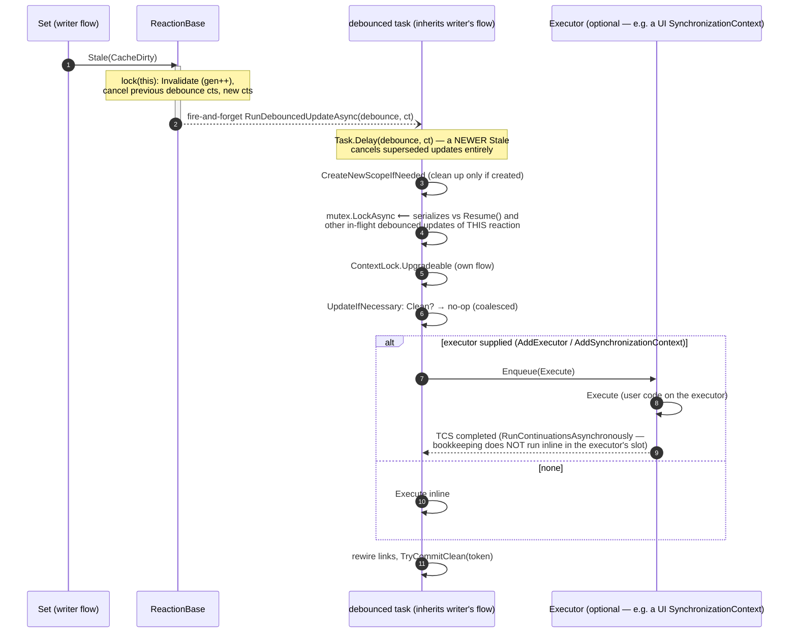

Design points, each pinned by a test:

- **Coalescing**: rapid `Set`s inside the debounce window cancel each other's pending updates;
  exactly one Execute runs with the final value (`DebounceCoalescesRapidUpdates`).
- **Per-node mutex**: two debounced updates inherit *different* flows' ContextLocks, which order
  nothing between them, and the generation guard protects only the `State` commit — not the
  ordering of `Execute`'s side effects. The node mutex is what prevents a stale in-flight
  `Execute` from applying its effects after a newer one finished
  (`Reaction_ExecutionsNeverOverlap_UnderConcurrentSets`).
- **Pause/Resume**: `isPaused` is a `volatile bool` checked twice in `Update` (before and after
  `BeginEvaluation`, because it can flip between them); a paused update parks the state at
  `Dirty`. `Resume` runs the pending update inline under mutex + ContextLock and cleans up only
  a scope it created — calling it from inside an active evaluation must not destroy the
  enclosing flow's scope (`Reaction_ResumeInsideActiveEvaluation_DoesNotDestroyEnclosingScope`).
- **Executor marshalling**: `Execute` is enqueued to the supplied `IExecutor` (a UI
  `SynchronizationContext` wrapped by `AddSynchronizationContext`, a `DedicatedThreadExecutor`,
  or a custom seat — the SE-0392 analog, [ADR 0005](../adr/0005-custom-executors.md)); its
  completion TCS uses `RunContinuationsAsynchronously` so commit/cleanup never runs inside the
  executor's slot, and the callback completes the TCS **exactly once** — a `SetResult` after
  `SetException` would escape the `async void` and crash the process
  (`Reaction_ExecuteThrowsUnderSynchronizationContext_FaultsResumeWithoutCrashingContext`).
- **Error semantics**: a throwing `Execute` re-marks the reaction `Dirty` (`Force`) and the
  exception propagates to `Resume` callers / is swallowed by the fire-and-forget debounce; the
  next `Set` retriggers normally.

---

## 12. Invariants, at a glance

| # | Invariant | Enforced by | Guarded by (tests) |
|---|---|---|---|
| I1 | At most one evaluation of a node at a time | node `mutex` | overlap gauge, lock stress |
| I2 | A committed `Clean` reflects every invalidation that preceded it | generation snapshot/commit (§6.2) | `Memo_StaleDuringRecompute…`, Coyote chain |
| I3 | A suppressed `Stale` still blocks racing commits | unconditional `gen++` (§6.3) | `Memo_SuppressedStaleDuringParentCheck…` |
| I4 | A refused commit cannot strand a descendant Clean-but-stale | renotify (§6.3) | chain stress, Coyote chain |
| I5 | Same-flow diamond marks don't force redundant recomputes | `InvalidateFromParent`, no bump (§6.4) | `TestDiamondInvocations` |
| I6 | Fast-path reads are linearizable snapshots, never torn | volatile + `ValueBox` release/acquire (§7) | wide-struct + monotonicity stress |
| I7 | A flow never deadlocks on its own ContextLock | flow-scoped reentrancy; impossible waits throw (§8) | recursion tests |
| I8 | Lock handoff never corrupts the releasing flow's scope | `ReleaseWaiters` leaves `AsyncLocal` alone (§8) | `ReleasingFlow_DoesNotCorruptScope…` |
| I9 | No lock-order cycles | child→parent mutexes, down-paths lock-free, leaf monitors never await (§9) | Coyote, suite under load |
| I10 | Join is the barrier: post-`WhenAll` reads need no locks | fork/join (§10) | structured suite |
| I11 | Scopes are cleaned up only by their creator | `CreateNewScopeIfNeeded` → `bool` (§2) | `Reaction_ResumeInsideActiveEvaluation…` |
| I12 | Reaction side effects are ordered per node | reaction mutex (§11) | `Reaction_ExecutionsNeverOverlap…` |

## 13. The user boundary: Sendable values and dynamic isolation checks

Everything above makes MemoizR's *own* state race-free — but the graph also shares **user
values** across flows: `Value` hands the same `T` reference to every consumer, including
lock-free fast-path readers, while any flow may be mutating the object behind it. That gap (and
the runtime checks that close it, modeled on Swift's `Sendable` + `preconditionIsolated`) is
recorded in [ADR 0003](../adr/0003-sendable-checking-and-isolation-assertions.md):

- `SendableChecker` structurally verifies that a type is deeply immutable or internally
  synchronized; `[Sendable]` is the trusted opt-in for types it cannot prove.
- `MemoFactoryOptions.StrictSendableChecks` enforces the check when value-bearing nodes are
  created (signals, memos, the concurrent nodes — including `ConcurrentRace`'s resolver result,
  which is handed to every racing child in parallel).
- `AsyncAsymmetricLock.IsHeldByCurrentFlow` + `Context.AssertEvaluationIsolated()` let code
  assert "I am inside a serialized graph evaluation"; a DEBUG-only assert in
  `UpdateSourceAndObserverLinks` mechanically pins its documented "only inside a
  ContextLock-serialized evaluation" contract on every recompute of every Debug test run.

These are boundary checks, not new synchronization: they change nothing in layers 1–5. The same
discipline is enforced at build time by the bundled `MemoizR.Analyzers` rules — MZR001
(non-Sendable creation type), MZR002 (computation writes captured/shared state), MZR003 (`Set`
inside a computation) — see [ADR 0004](../adr/0004-compile-time-data-race-diagnostics.md).

## 14. How this is verified

Three complementary techniques, because no single one can prove a memory model:

1. **Deterministic interleaving tests** — `TaskCompletionSource` gates (created with
   `RunContinuationsAsynchronously`) park an evaluation at the exact instruction where a race
   matters, inject the conflicting operation, then resume. These reproduce I2 and I3 *exactly*,
   and each was verified to fail with its fix reverted.
2. **Stress tests** — fast-path reader storms (tearing, monotonicity), multi-level chain
   convergence under concurrent Sets/Gets, 100-acquirer lock storms with leak/drain assertions.
   Probabilistic, but they sweep interleavings no one thought to gate. Convergence is always
   asserted by *polling* (`TestHelpers.WaitForConvergenceAsync`); fixed delays are reserved for
   negative assertions ("nothing further may happen"), which cannot be polled.
3. **Coyote systematic testing** — CI rewrites the assemblies and explores schedules exhaustively
   (within iteration budgets) for the single-memo storm and the two-level chain race. Caveat:
   Coyote (1.7.x) cannot instrument .NET 9's `System.Threading.Lock`, so its heuristic hang
   monitor is disabled for the chain test (the value assertion is the bug detector — validated to
   catch the I3 bug systematically); the static release/acquire arguments in §7 remain the
   authority for pure memory-model claims, as tests cannot prove visibility on a relaxed model.
